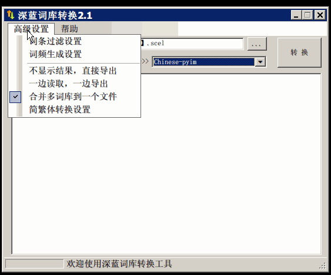

- [pyim 使用说明](#orgf8eb26c)
  - [截图](#org1677e30)
  - [简介](#orga35e1e1)
  - [背景](#orge28a77c)
  - [目标](#orgc3e1a5d)
  - [特点](#orgcf47fee)
  - [安装](#orgbe79e0a)
  - [配置](#orgde4dc0b)
    - [配置实例](#orgcbcafbe)
    - [添加词库文件](#org6a49f6b)
    - [激活 pyim](#orgcb60bc8)
  - [使用](#orgc4871b6)
    - [常用快捷键](#orgc181ed4)
    - [使用双拼模式](#orgd4f1965)
    - [使用五笔输入](#org6f55fa7)
    - [使用仓颉输入法](#orgc740737)
    - [让选词框跟随光标](#org4978653)
    - [调整 tooltip 选词框的显示样式](#orgb2b50bd)
    - [设置模糊音](#orgd82ab2d)
    - [切换全角标点与半角标点](#orgf9a2af9)
    - [手动加词和删词](#org62d4837)
    - [pyim 高级功能](#orgabd8331)
  - [捐赠](#orgbea0b72)
  - [Tips](#org7a74287)
    - [如何将个人词条导出到一个文件](#org41794d5)
    - [pyim 出现错误时，如何开启 debug 模式](#org809bd98)
    - [选词框弹出位置不合理或者选词框内容显示不全](#orgb81e4fd)
    - [如何查看 pyim 文档。](#org00f55dc)
    - [将光标处的拼音或者五笔字符串转换为中文 (与 vimim 的 “点石成金” 功能类似)](#org486df89)
    - [如何添加自定义拼音词库](#org698000f)
    - [如何手动安装和管理词库](#orgaef8209)
    - [Emacs 启动时加载 pyim 词库](#org19b4957)
    - [将汉字字符串转换为拼音字符串](#orge9d1c9e)
    - [中文分词](#org991fb7b)
    - [获取光标处的中文词条](#org5f44443)
    - [让 \`forward-word' 和 \`back-backward’ 在中文环境下正常工作](#orgca14f50)
    - [为 isearch 相关命令添加拼音搜索支持](#orgd20a2c2)

# pyim 使用说明

## 截图

## 简介

pyim 是 Emacs 环境下的一个中文输入法，最初它只支持全拼输入，所以当时 "pyim" 代表 "Chinese Pinyin Input Method" 的意思，后来根据同学的提议， 添加了五笔的支持，再叫 “拼音输入法” 就不太合适了，所以你现在可以将它理解 为 “PengYou input method”： 平时像朋友一样帮助你，偶尔也像朋友一样犯二 。。。

## 背景

pyim 的代码源自 emacs-eim。

emacs-eim 是 Emacs 环境下的一个中文输入法框架， 支持拼音，五笔，仓颉以及二笔等 多种输入法，但遗憾的是，2008 年之后它就停止了开发，我认为主要原因是外部中文输入法快速发展。

虽然外部输入法功能强大，但不能和 Emacs 默契的配合，这一点极大的损害了 Emacs 那种 **行云流水** 的感觉。而本人在使用（或者叫折腾） emacs-eim 的过程中发现：

1.  **当 emacs-eim 词库词条超过 100 万时，选词频率大大降低，中文体验增强。**
2.  **随着使用时间的延长，emacs-eim 会越来越好用（个人词库的积累）。**

于是我 fork 了 emacs-eim 输入法的部分代码, 创建了一个项目：pyim。

## 目标

pyim 的目标是： **尽最大的努力成为一个好用的 Emacs 中文输入法** ， 具体可表现为三个方面：

1.  Fallback: 当外部输入法不能使用时，比如在 console 或者 cygwin 环境 下，尽最大可能让 Emacs 用户不必为输入中文而烦恼。
2.  Integration: 尽最大可能减少输入法切换频率，让中文输入不影响 Emacs 的体验。
3.  Exchange: 尽最大可能简化 pyim 使用其他优秀输入法的词库 的难度和复杂度。

## 特点

1.  pyim 支持全拼，双拼，五笔和仓颉，其中对全拼的支持最好。
2.  pyim 通过添加词库的方式优化输入法。
3.  pyim 使用文本词库格式，方便处理。

## 安装

1.  配置 melpa 源，参考：<http://melpa.org/#/getting-started>
2.  M-x package-install RET pyim RET
3.  在 Emacs 配置文件中（比如: ~/.emacs）添加如下代码：

        (require 'pyim)
        (require 'pyim-basedict) ; 拼音词库设置，五笔用户 *不需要* 此行设置
        (pyim-basedict-enable)   ; 拼音词库，五笔用户 *不需要* 此行设置
        (setq default-input-method "pyim")

## 配置

### 配置实例

对 pyim 感兴趣的同学，可以看看本人的 pyim 配置（总是适用于最新版的 pyim）:

    (use-package pyim
      :ensure nil
      :config
      ;; 激活 basedict 拼音词库
      (use-package pyim-basedict
        :ensure nil
        :config (pyim-basedict-enable))

      ;; 五笔用户使用 wbdict 词库
      ;; (use-package pyim-wbdict
      ;;   :ensure nil
      ;;   :config (pyim-wbdict-gbk-enable))

      (setq default-input-method "pyim")

      ;; 我使用全拼
      (setq pyim-default-scheme 'quanpin)

      ;; 设置 pyim 探针设置，这是 pyim 高级功能设置，可以实现 *无痛* 中英文切换 :-)
      ;; 我自己使用的中英文动态切换规则是：
      ;; 1. 光标只有在注释里面时，才可以输入中文。
      ;; 2. 光标前是汉字字符时，才能输入中文。
      ;; 3. 使用 M-j 快捷键，强制将光标前的拼音字符串转换为中文。
      (setq-default pyim-english-input-switch-functions
                    '(pyim-probe-dynamic-english
                      pyim-probe-isearch-mode
                      pyim-probe-program-mode
                      pyim-probe-org-structure-template))

      (setq-default pyim-punctuation-half-width-functions
                    '(pyim-probe-punctuation-line-beginning
                      pyim-probe-punctuation-after-punctuation))

      ;; 开启拼音搜索功能
      (setq pyim-isearch-enable-pinyin-search t)

      ;; 使用 pupup-el 来绘制选词框
      (setq pyim-page-tooltip 'popup)

      ;; 选词框显示5个候选词
      (setq pyim-page-length 5)

      ;; 让 Emacs 启动时自动加载 pyim 词库
      (add-hook 'emacs-startup-hook
                #'(lambda () (pyim-restart-1 t)))
      :bind
      (("M-j" . pyim-convert-code-at-point) ;与 pyim-probe-dynamic-english 配合
       ("C-;" . pyim-delete-word-from-personal-buffer)))

### 添加词库文件

pyim 当前的默认的拼音词库是 pyim-basedict, 这个词库的词条量 8 万左右，是一个 **非常小** 的拼音词库，词条的来源有两个：

1.  libpinyin 项目的内置词库
2.  pyim 用户贡献的个人词库

注意： 这个词库只能确保 pyim 可以正常工作，如果用户想让 pyim 更加顺手，需要添加附加的词库，一个比较好的选择是安装 pyim-greatdict:

<https://github.com/tumashu/pyim-greatdict>

pyim-greatdict 包对应的词库由 [WenLiang Xiao](https://github.com/xiaowl) 同学开发制作， 词条有 300 万条，词库文件大约 80M, 是一个 **大而全** 的词库， 用户可以通过 Melpa 来安装它：

1.  配置melpa源，参考：<http://melpa.org/#/getting-started>
2.  M-x package-install RET pyim-greatdict RET
3.  在emacs配置文件中（比如: ~/.emacs）添加如下代码：

        (require 'pyim-greatdict)
        (pyim-greatdict-enable)

但值得注意的是：

1.  如果机器性能不好，安装 pyim-greatdict 会导致 pyim 启动 非常缓慢，请仔细考虑。
2.  这个词库使用 gzip 压缩，非 Linux 用户需要安装 [gzip](http://www.gzip.org/) 程序， 并配置好系统 PATH 。

如果 pyim-greatdict 不能满足需求，用户可以使用其他方式为 pyim 添加拼音词库， 具体方式请参考 [1.10.6](#org698000f) 小结。

### 激活 pyim

    (setq default-input-method "pyim")
    (global-set-key (kbd "C-\\") 'toggle-input-method)

## 使用

### 常用快捷键

| 输入法快捷键         | 功能          |
|-------------------- |------------- |
| C-n 或 M-n 或 +      | 向下翻页      |
| C-p 或 M-p 或 -      | 向上翻页      |
| C-f                  | 选择下一个备选词 |
| C-b                  | 选择上一个备选词 |
| SPC                  | 确定输入      |
| RET 或 C-m           | 字母上屏      |
| C-c                  | 取消输入      |
| C-g                  | 取消输入并保留已输入的中文 |
| TAB                  | 模糊音调整    |
| DEL 或 BACKSPACE     | 删除最后一个字符 |
| C-DEL 或  C-BACKSPACE | 删除最后一个拼音 |
| M-DEL 或  M-BACKSPACE | 删除最后一个拼音 |

### 使用双拼模式

pyim 支持双拼输入模式，用户可以通过变量 \`pyim-default-scheme' 来设定：

    (setq pyim-default-scheme 'pyim-shuangpin)

注意：

1.  pyim 支持微软双拼（microsoft-shuangpin）和小鹤双拼（xiaohe-shuangpin）。
2.  用户可以使用变量 \`pyim-schemes' 添加自定义双拼方案。
3.  用户可能需要重新设置 \`pyim-translate-trigger-char'。

### 使用五笔输入

pyim 支持五笔输入模式，用户可以通过变量 \`pyim-default-scheme' 来设定：

    (setq pyim-default-scheme 'wubi)

在使用五笔输入法之前，请用 pyim-dicts-manager 添加一个五笔词库，词库的格式类似：

    # ;;; -*- coding: utf-8-unix -*-
    .aaaa 工
    .aad 式
    .aadk 匿
    .aadn 慝 葚
    .aadw 萁
    .aafd 甙
    .aaff 苷
    .aaht 芽
    .aak 戒

最简单的方式是从 melpa 中安装 pyim-wbdict 包，然后根据它的 [README](https://github.com/tumashu/pyim-wbdict) 来配置。

### 使用仓颉输入法

pyim 支持仓颉输入法，用户可以通过变量 \`pyim-default-scheme' 来设定：

    (setq pyim-default-scheme 'cangjie)

在使用仓颉输入法之前，请用 pyim-dicts-manager 添加一个仓颉词库，词库的格式类似：

    # ;;; -*- coding: utf-8-unix -*-
    @a 日
    @a 曰
    @aa 昌
    @aa 昍
    @aaa 晶
    @aaa 晿
    @aaah 曑

如果用户使用仓颉第五代，最简单的方式是从 melpa 中安装 pyim-cangjie5dict 包， 然后根据它的 [README](https://github.com/erstern/pyim-cangjie5dict) 来配置。 pyim 支持其它版本的仓颉，但需要用户自己创建词库文件。

用户可以使用命令：\`pyim-search-word-code' 来查询当前选择词条的仓颉编码

### 让选词框跟随光标

用户可以通过下面的设置让 pyim 在 **光标处** 显示一个选词框：

1.  使用 popup 包来绘制选词框 （emacs overlay 机制）

        (setq pyim-page-tooltip 'popup)
2.  使用 pos-tip 包来绘制选词框（emacs tooltip 机制）

        (setq pyim-page-tooltip 'pos-tip)

注：Linux 平台下，emacs 可以使用 GTK 来绘制选词框：

    (setq pyim-page-tooltip 'pos-tip)
    (setq x-gtk-use-system-tooltips t)

GTK 选词框的字体设置可以参考：[GTK resources](https://www.gnu.org/software/emacs/manual/html_node/emacs/GTK-resources.html#GTK-resources) 。

### 调整 tooltip 选词框的显示样式

pyim 的 tooltip 选词框默认使用 **双行显示** 的样式，在一些特 殊的情况下（比如：popup 显示的菜单错位），用户可以使用 **单行显示** 的样式：

    (setq pyim-page-style 'one-line)

注：用户可以添加函数 pyim-page-style-STYLENAME-style 来定义自己的选词框格式。

### 设置模糊音

可以通过设置 \`pyim-fuzzy-pinyin-alist' 变量来自定义模糊音。

### 切换全角标点与半角标点

1.  第一种方法：使用命令 \`pyim-punctuation-toggle'，全局切换。
2.  第二种方法：使用命令 \`pyim-punctuation-translate-at-point' 只切换光 标处标点的样式。
3.  第三种方法：设置变量 \`pyim-translate-trigger-char' ，输入变量设定的 字符会切换光标处标点的样式。

### 手动加词和删词

1.  \`pyim-create-Ncchar-word-at-point 这是一组命令，从光标前提取N个汉 字字符组成字符串，并将其加入个人词库。
2.  \`pyim-translate-trigger-char' 以默认设置为例：在“我爱吃红烧肉”后输 入“5v” 可以将“爱吃红烧肉”这个词条保存到用户个人词库。
3.  \`pyim-create-word-from-selection', 选择一个词条，运行这个命令后，就 可以将这个词条添加到个人词库。
4.  \`pyim-delete-word' 从个人词库中删除当前高亮选择的词条。

### pyim 高级功能

1.  根据环境自动切换到英文输入模式，使用 pyim-english-input-switch-functions 配置。
2.  根据环境自动切换到半角标点输入模式，使用 pyim-punctuation-half-width-functions 配置。

注意：上述两个功能使用不同的变量设置， **千万不要搞错** 。

1.  根据环境自动切换到英文输入模式

    | 探针函数                          | 功能说明                                                |
    |--------------------------------- |------------------------------------------------------- |
    | pyim-probe-program-mode           | 如果当前的 mode 衍生自 prog-mode，那么仅仅在字符串和 comment 中开启中文输入模式 |
    | pyim-probe-org-speed-commands     | 解决 org-speed-commands 与 pyim 冲突问题                |
    | pyim-probe-isearch-mode           | 使用 isearch 搜索时，强制开启英文输入模式               |
    |                                   | 注意：想要使用这个功能，pyim-isearch-enable-pinyin-search 必须设置为 t |
    | pyim-probe-org-structure-template | 使用 org-structure-template 时，关闭中文输入模式        |
    |                                   | 1. 当前字符为中文字符时，输入下一个字符时默认开启中文输入 |
    | pyim-probe-dynamic-english        | 2. 当前字符为其他字符时，输入下一个字符时默认开启英文输入 |
    |                                   | 3. 使用命令 pyim-convert-code-at-point 可以将光标前的拼音字符串强制转换为中文。 |

    激活方式：

        (setq-default pyim-english-input-switch-functions
                      '(probe-function1 probe-function2 probe-function3))

    注：上述函数列表中，任意一个函数的返回值为 t 时，pyim 切换到英文输入模式。

2.  根据环境自动切换到半角标点输入模式

    | 探针函数                                 | 功能说明      |
    |---------------------------------------- |------------- |
    | pyim-probe-punctuation-line-beginning    | 行首强制输入半角标点 |
    | pyim-probe-punctuation-after-punctuation | 半角标点后强制输入半角标点 |

    激活方式：

        (setq-default pyim-punctuation-half-width-functions
                      '(probe-function4 probe-function5 probe-function6))

    注：上述函数列表中，任意一个函数的返回值为 t 时，pyim 切换到半角标点输入模式。

## 捐赠

您可以通过小额捐赠的方式支持 pyim 的开发工作，具体方式：

1.  通过支付宝收款账户：tumashu@163.com
2.  通过支付宝钱包扫描：

    

## Tips

### 如何将个人词条导出到一个文件

使用命令：pyim-dcache-export-personal-dcache

### pyim 出现错误时，如何开启 debug 模式

    (setq debug-on-error t)

### 选词框弹出位置不合理或者选词框内容显示不全

可以通过设置 \`pyim-tooltip-width-adjustment' 变量来手动校正。

1.  选词框内容显示不全：增大变量值
2.  选词框弹出位置不合理：减小变量值

### 如何查看 pyim 文档。

pyim 的文档隐藏在 comment 中，如果用户喜欢阅读 html 格式的文档， 可以查看在线文档；

<http://tumashu.github.io/pyim/>

### 将光标处的拼音或者五笔字符串转换为中文 (与 vimim 的 “点石成金” 功能类似)

    (global-set-key (kbd "M-i") 'pyim-convert-code-at-point)

### 如何添加自定义拼音词库

pyim 默认没有携带任何拼音词库，用户可以使用下面几种方式，获取 质量较好的拼音词库：

1.  第一种方式 (懒人推荐使用)

    获取其他 pyim 用户的拼音词库，比如，某个同学测试 pyim 时创建了一个中文拼音词库，词条数量大约60万。

    <http://tumashu.github.io/pyim-bigdict/pyim-bigdict.pyim.gz>

    下载上述词库后，运行 \`pyim-dicts-manager' ，按照命令提示，将下载得到的词库 文件信息添加到 \`pyim-dicts' 中，最后运行命令 \`pyim-restart' 或者重启 emacs，这个词库使用 \`utf-8-unix' 编码。

2.  第二种方式 (Windows 用户推荐使用)

    使用词库转换工具将其他输入法的词库转化为pyim使用的词库：这里只介绍windows平 台下的一个词库转换软件：

    1.  软件名称： imewlconverter
    2.  中文名称： 深蓝词库转换
    3.  下载地址： <https://github.com/studyzy/imewlconverter>
    4.  依赖平台： Microsoft .NET Framework (>= 3.5)

    使用方式：

    

    如果生成的词库词频不合理，可以按照下面的方式处理（非常有用的功能）：

    

    生成词库后，运行 \`pyim-dicts-manager' ，按照命令提示，将转换得到的词库文件的信息添加到 \`pyim-dicts' 中， 完成后运行命令 \`pyim-restart' 或者重启emacs。

3.  第三种方式 (Linux & Unix 用户推荐使用)

    E-Neo 同学编写了一个词库转换工具: [scel2pyim](https://github.com/E-Neo/scel2pyim) , 可以将一个搜狗词库转换为 pyim 词库。

    1.  软件名称： scel2pyim
    2.  下载地址： <https://github.com/E-Neo/scel2pyim>
    3.  编写语言： C语言

### 如何手动安装和管理词库

这里假设有两个词库文件：

1.  /path/to/pyim-dict1.pyim
2.  /path/to/pyim-dict2.pyim

在~/.emacs文件中添加如下一行配置。

    (setq pyim-dicts
          '((:name "dict1" :file "/path/to/pyim-dict1.pyim")
            (:name "dict2" :file "/path/to/pyim-dict2.pyim")))

注意事项:

1.  只有 :file 是 **必须** 设置的。
2.  必须使用词库文件的绝对路径。
3.  词库文件的编码必须为 utf-8-unix，否则会出现乱码。

### Emacs 启动时加载 pyim 词库

    (add-hook 'emacs-startup-hook
              #'(lambda () (pyim-restart-1 t)))

### 将汉字字符串转换为拼音字符串

下面两个函数可以将中文字符串转换的拼音字符串或者列表，用于 emacs-lisp 编程。

1.  \`pyim-hanzi2pinyin' （考虑多音字）
2.  \`pyim-hanzi2pinyin-simple' （不考虑多音字）

### 中文分词

pyim 包含了一个简单的分词函数：\`pyim-cstring-split-to-list', 可以 将一个中文字符串分成一个词条列表，比如：

                      (("天安" 5 7)
    我爱北京天安门 ->  ("天安门" 5 8)
                       ("北京" 3 5)
                       ("我爱" 1 3))

其中，每一个词条列表中包含三个元素，第一个元素为词条本身，第二个元素为词条 相对于字符串的起始位置，第三个元素为词条结束位置。

另一个分词函数是 \`pyim-cstring-split-to-string', 这个函数将生成一个新的字符串， 在这个字符串中，词语之间用空格或者用户自定义的分隔符隔开。

注意，上述两个分词函数使用暴力匹配模式来分词，所以， **不能检测出** pyim 词库中不存在的中文词条。

### 获取光标处的中文词条

pyim 包含了一个简单的命令：\`pyim-cwords-at-point', 这个命令 可以得到光标处的 **英文** 或者 **中文** 词条的 \*列表\*，这个命令依赖分词函数： \`pyim-cstring-split-to-list'。

### 让 \`forward-word' 和 \`back-backward’ 在中文环境下正常工作

中文词语没有强制用空格分词，所以 Emacs 内置的命令 \`forward-word' 和 \`backward-word' 在中文环境不能按用户预期的样子执行，而是 forward/backward “句子” ，pyim 自带的两个命令可以在中文环境下正常工作：

1.  \`pyim-forward-word
2.  \`pyim-backward-word

用户只需将其绑定到快捷键上就可以了，比如：

    (global-set-key (kbd "M-f") 'pyim-forward-word)
    (global-set-key (kbd "M-b") 'pyim-backward-word)

### 为 isearch 相关命令添加拼音搜索支持

pyim 安装后，可以通过下面的设置开启拼音搜索功能：

    (setq pyim-isearch-enable-pinyin-search t)

值得注意的是：这个功能有一些限制：搜索字符串中只能出现 “a-z” 和 “’”，如果有 其他字符（比如 regexp 操作符），则自动关闭拼音搜索功能。

如果用户开启了拼音搜索功能，可以使用下面的方式 **强制关闭** isearch 搜索框中文输入 （即使在 pyim 激活的时候）。

    (setq-default pyim-english-input-switch-functions
                  '(pyim-probe-isearch-mode))

Converted from pyim.el by [el2org](https://github.com/tumashu/el2org) .